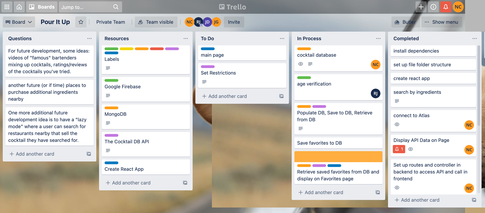
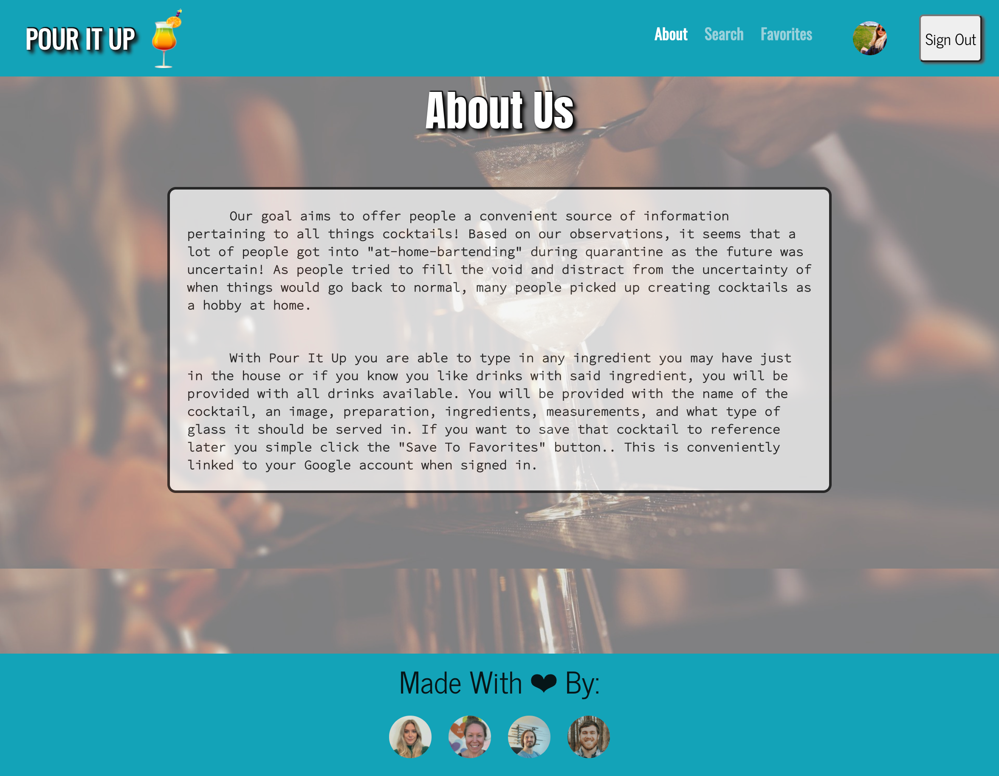

# Pour_It_Up

[](https://opensource.org/licenses/MIT)

## Description

MERN stack app aimed at those new found bartenders during the 2020 Covid-19 quarantine lockdown. This app helps in assisting those with drink ingredients, preparations, glass, and more!

With <bold>Pour It Up </bold> you are able to type in any
ingredient you may have just in the house or if you know you like
drinks with said ingredient, you will be provided with all drinks
available. You can type in ingredient, a liquor, even a garnish
and once you click search you are provided with cocktails in that
category! You will be provided with the name of the cocktail, an
image, preparation, ingredients, measurements, and what type of
glass it should be served in. If you want to save that cocktail to
reference later you simple click the "Save To Favorites" button.
When on the favorites page, when you hover over the cocktail it
displays the details on the back. When you are finished with a
cocktail, you can click delete and remove it from your favorites.
This is conveniently linked to your Google account when signed in.

:round_pushpin: [Click here to view deployed page!](https://pour-it-up.herokuapp.com/) :round_pushpin:

## Table of Contents

- [Demonstration](#demonstration)
- [Features](#features)
- [Usage](#usage)
- [License](#license)
- [Contribution](#contribution)
- [Technologies](#technologies)
- [Contact Information](#contact-information)

## Demonstration

### Project Management Board



### Overview


### About Page



### Search Page


### Favorites Page


# Features

- Using The Cocktail DB API, user is able to type in any ingredient and any cocktail available in the database will be displayed.
  If the user is interested in the cocktail based on the photo, they can click `Select Drink` and a card will be displayed with the following information:
  ` Drink Name, Image, Ingredients, Measurements, Preparation, Glassware and Type (Alcoholic or Non Alcoholic) `
- User is able to save cocktails to `Favorites` to go back and reference. User is also able to delete from favorites when finished with that cocktail.
- Favorites are linked to user Google Sign In. If they do not have a Google Account, they have the option to sign up through our page.

### Directory Structure

```
│
├── client
│   └── node_modules
│   └── public
│       └── assets
│           └── img
│               └── favicon.ico
│               └── fruity.jpeg
│               └── logo.png
│       └── index.html
│       └── manifest.json
│       └── robots.txt
│   └── src
│        └── assets
│           └── img
│               └── beach.jpeg
│               └── bg.jpg
│               └── jessica.jpeg
│               └── jon.jpeg
│               └── logo.png
│               └── niki.jpeg
│               └── Project-Board.png
│               └── search2.jpeg
│               └── truss.jpeg
│   └── components
│       └── CocktailData
│           └── CocktailData.js
│           └── CocktailList.js
│       └── Favorite
│           └── Favorite.js
│           └── style.css
│       └── Footer
│           └── index.js
│           └── style.css
│       └── Nav
│           └── Navigation.js
│       └── PasswordReset
│           └── index.js
│           └── style.css
│       └── ProfilePage
│           └── Avatar.js
│           └── index.js
│       └── ScrollBtn
│           └── index.js
│       └── SignIn
│           └── index.js
│           └── style.css
│       └── SignUp
│           └── index.js
│           └── style.css
│   └── pages
│       └── About.js
│       └── Favorites.js
│       └── Home.js
│       └── Search.js
│   └── Providers
│       └── UserProvider.jsx
│   └── utils
│       └── API.js
│   └── App.css
│   └── App.jsx
│   └── firebase.js
│   └── index.css
│   └── index.js
│   └── package-lock.json
│   └── package.json 
│   └── README.md
├── controllers
│   └── cocktailsController.js
│   └── drinkIdController.js
│   └── searchController.js
├── models
│   └── cocktail.js
│   └── index.js
├── node_modules
├── routes
│   └── api
│       └── cocktails.js
│       └── drink.js
│       └── index.js
│       └── search.js
│   └── index.js
├── scripts
│   └── seedDB.js
├── package-lock.json
├── package.json  
├── Procfile
├── README.md
├── server.js
```

## Usage

[Click here to deploy application!](https://pour-it-up.herokuapp.com/)

## License

[](https://opensource.org/licenses/MIT)

This application is licensed under the MIT License.

## Authors

### [Jessica Deck](https://github.com/deck-jessica)


---

### [Jon Gudenzi](https://github.com/JonGudenzi)


---

### [Trey Jewett](https://github.com/treyjewett)


---

### [Nicole Catapano](https://github.com/nsc9605)


## Technologies

- [React](https://reactjs.org/)
- [Node.js](https://nodejs.org/en/)
- [Express.js](https://expressjs.com/)
- [MongoDB](https://www.mongodb.com/)
- [Mongoose](https://mongoosejs.com/docs/)
- [Material UI](https://material-ui.com/)
- [The Cocktail DB](https://thecocktaildb.com/)
- [Trello](https://trello.com)
- [Google Firebase](https://firebase.google.com/products/auth)
- [MongoDB Atlas](https://www.mongodb.com/cloud/atlas)
- [Heroku](https://devcenter.heroku.com/articles/getting-started-with-nodejs)
- [Dotenv](https://www.npmjs.com/package/dotenv)
- [Visual Studio Code](https://code.visualstudio.com/)

## Contact Information

### Email:

- [Jessica Deck](mailto:deck.jessica@gmail.com)
- [Jon Gudenzi](mailto:jongudenzi@gmail.com)
- [Trey Jewett](mailto:rfjewett3@gmail.com)
- [Nicole Catapano](mailto:nsc9605@gmail.com)

# From React.js

## Getting Started with Create React App

This Search was bootstrapped with [Create React App](https://github.com/facebook/create-react-app).

## Available Scripts

In the Search directory, you can run:

### `npm start`

Runs the app in the development mode.\
Open [http://localhost:3000](http://localhost:3000) to view it in the browser.

The page will reload if you make edits.\
You will also see any lint errors in the console.

### `npm test`

Launches the test runner in the interactive watch mode.\
See the section about [running tests](https://facebook.github.io/create-react-app/docs/running-tests) for more information.

### `npm run build`

Builds the app for production to the `build` folder.\
It correctly bundles React in production mode and optimizes the build for the best performance.

The build is minified and the filenames include the hashes.\
Your app is ready to be deployed!

See the section about [deployment](https://facebook.github.io/create-react-app/docs/deployment) for more information.

### `npm run eject`

**Note: this is a one-way operation. Once you `eject`, you can’t go back!**

If you aren’t satisfied with the build tool and configuration choices, you can `eject` at any time. This command will remove the single build dependency from your Search.

Instead, it will copy all the configuration files and the transitive dependencies (webpack, Babel, ESLint, etc) right into your Search so you have full control over them. All of the commands except `eject` will still work, but they will point to the copied scripts so you can tweak them. At this point you’re on your own.

You don’t have to ever use `eject`. The curated feature set is suitable for small and middle deployments, and you shouldn’t feel obligated to use this feature. However we understand that this tool wouldn’t be useful if you couldn’t customize it when you are ready for it.

## Learn More

You can learn more in the [Create React App documentation](https://facebook.github.io/create-react-app/docs/getting-started).

To learn React, check out the [React documentation](https://reactjs.org/).

### Code Splitting

This section has moved here: [https://facebook.github.io/create-react-app/docs/code-splitting](https://facebook.github.io/create-react-app/docs/code-splitting)

### Analyzing the Bundle Size

This section has moved here: [https://facebook.github.io/create-react-app/docs/analyzing-the-bundle-size](https://facebook.github.io/create-react-app/docs/analyzing-the-bundle-size)

### Making a Progressive Web App

This section has moved here: [https://facebook.github.io/create-react-app/docs/making-a-progressive-web-app](https://facebook.github.io/create-react-app/docs/making-a-progressive-web-app)

### Advanced Configuration

This section has moved here: [https://facebook.github.io/create-react-app/docs/advanced-configuration](https://facebook.github.io/create-react-app/docs/advanced-configuration)

### Deployment

This section has moved here: [https://facebook.github.io/create-react-app/docs/deployment](https://facebook.github.io/create-react-app/docs/deployment)

### `npm run build` fails to minify

This section has moved here: [https://facebook.github.io/create-react-app/docs/troubleshooting#npm-run-build-fails-to-minify](https://facebook.github.io/create-react-app/docs/troubleshooting#npm-run-build-fails-to-minify)
